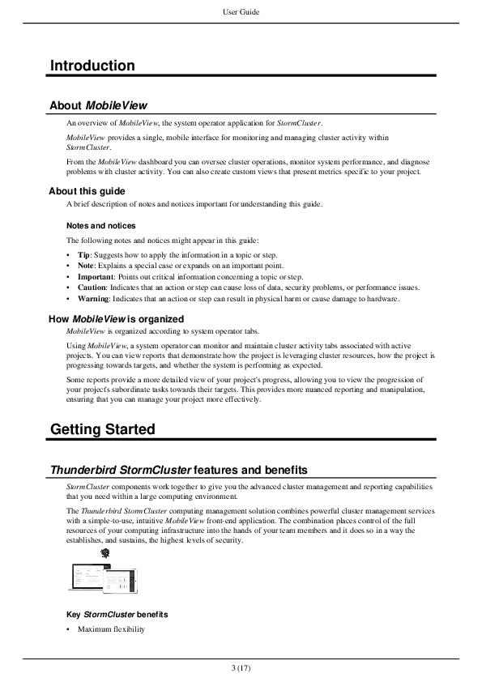
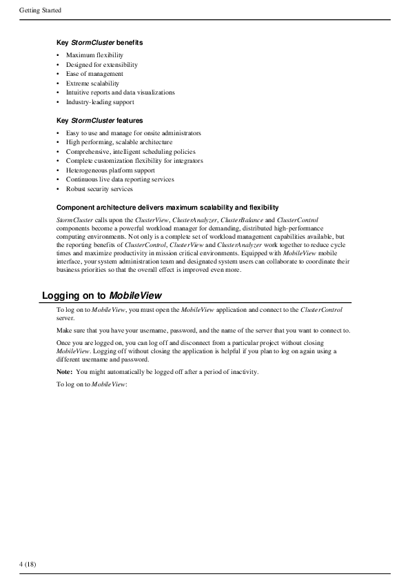
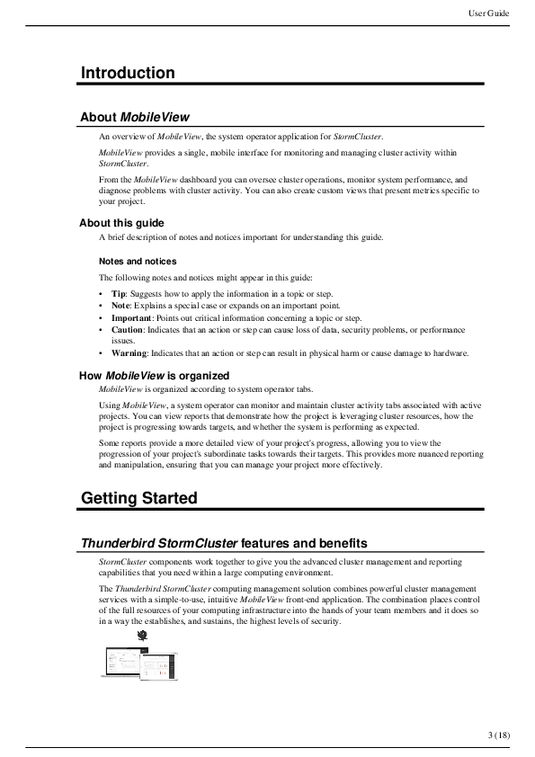
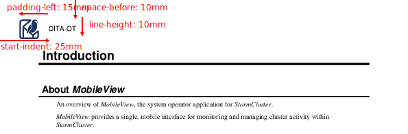

The `content` key in `header` or `footer` can be used to add text to running header or footer content. Content can include static text, or reference variables using curly braces.

The following variable fields are currently supported:

- `{title}`: Map title
- `{chapter-or-part-or-appendix}`: Map chapter, part, or appendix number and title
- `{chapter}`: Map chapter number and title
- `{chapter-title}`: Map chapter title
- `{chapter-number}`: Map chapter number
- `{part}`: Map part number and title
- `{part-title}`: Map part title
- `{part-number}`: Map part number
- `{appendix}`: Map appendix number and title
- `{appendix-title}`: Map appendix title
- `{appendix-number}`: Map appendix number
- `{folio}`: Current page number
- `{folio-with-total}`: Current page number with total number of pages
- `{page-number}`: Current page number
- `{page-count}`: Total number of pages
- `{year}`: Current year

```yaml
header:
  content: '{title} — {chapter}'
  border-bottom: solid 1pt black
```

## Header and footer size and alignment

To adjust the placement of page headers and footers, define the [Page settings](Page-settings.md) and use the `extent` and `display-align` keys.

```yaml
page:
  size: A4
  # The body content starts 30 mm from top of page edge.
  top: 30mm
  outside: 20mm
  # The body content ends 30 mm from bottom of page edge.
  bottom: 30mm
  inside: 20mm
header:
  content: '{title}'
  # The header starts directly from top of page edge and is 20 mm high.
  extent: 20mm
  # The header starts 20 mm from start/left of page edge
  start-indent: 20mm
  # The header content is vertically aligned to bottom of header.
  display-align: after
footer:
  content: '{folio-with-total}'
  # The footer starts directly from bottom of page edge and is 20 mm high.
  extent: 20mm
  # The footer starts 20 mm from start/left of page edge
  start-indent: 20mm
  # The footer content is vertically aligned to top of footer.
  display-align: before
```

If `extent` is not set, the value defaults to page `top` for header and page `bottom` for footer.

## Simple header and footer

The same headers and footers can be used on all pages.

```yaml
header:
  content: '{title}'
  start-indent: 10mm
  end-indent: 10mm
  border-bottom: solid 1pt black
  text-align: center
footer:
  content: '{folio-with-total}'
  start-indent: 10mm
  end-indent: 10mm
  border-top: solid 1pt black
  text-align: center
```



## Duplex header and footer

To define separate headers or footers for recto (right) and verso (left) pages, use the `odd` and `even` keys.

```yaml
# Generate duplex header and footer
mirror-page-margins: true
header:
  start-indent: 10mm
  end-indent: 10mm
  padding-after: 6pt
  border-bottom: solid 1pt black
  odd:
    content: '{title}'
    # On odd/right/recto pages, horizontally align content to end/right side.
    text-align: end
  even:
    content: '{chapter}'
    # On even/left/verso pages, horizontally align content to start/left side.
    text-align: start
footer:
  start-indent: 10mm
  end-indent: 10mm
  padding-after: 6pt
  border-bottom: solid 1pt black
  odd:
    content: '{folio-with-total}'
    text-align: end
  even:
    content: '{folio-with-total}'
    text-align: start
```

 

## Header image

To add an image to page headers, use the `background-image` key and adjust the placement via `padding`, `space-before`, `start-indent`, etc.

```yaml
header:
  content: 'DITA-OT'
  # Text starts 25 mm from left page edge.
  start-indent: 25mm
  # Header starts 10 mm from top page edge.
  space-before: 10mm
  # Header height is 10 mm
  line-height: 10mm
  # Image left edge is 15 mm from left text edge (10 mm from left page edge)
  padding-left: 15mm
  text-align: start
  font-family: Helvetica
  dominant-baseline: middle
  # 10 mm x 10 mm image
  background-image: dita-ot-logo.svg
  background-repeat: no-repeat
```


